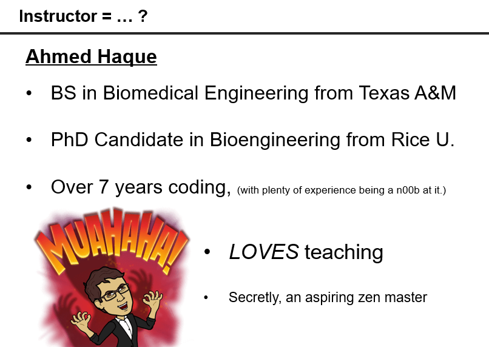
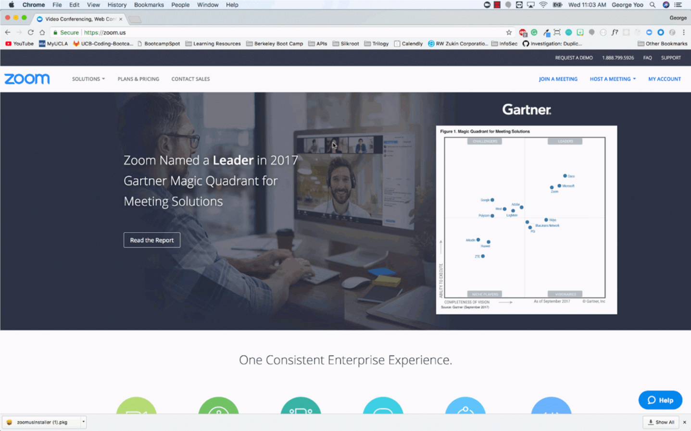
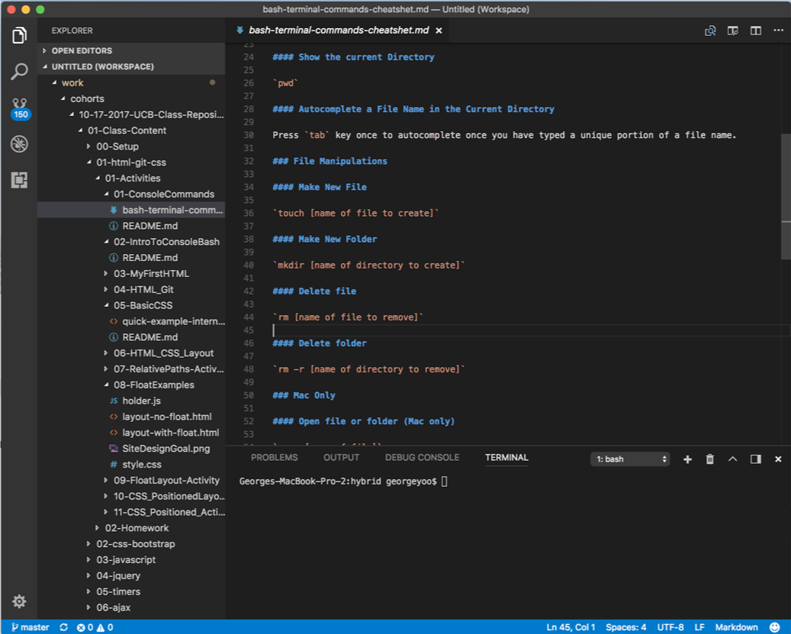
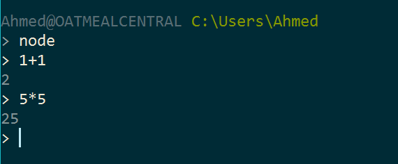
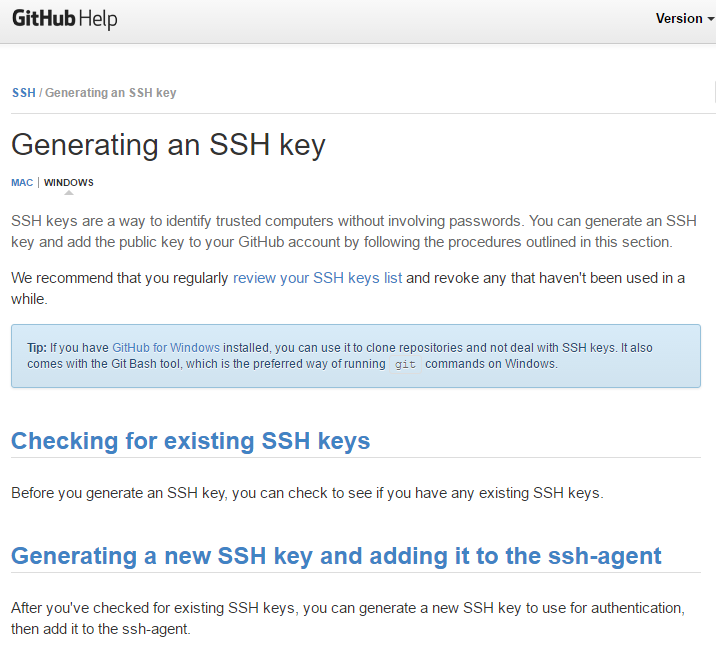
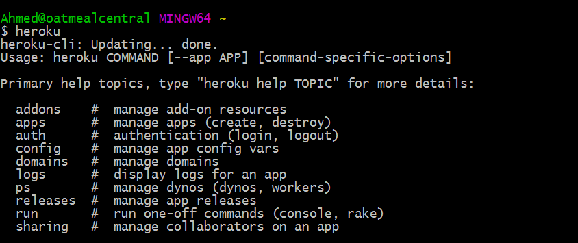

## 0.1 - Welcome and Installation (10:00 AM)

### Overview

Welcome to your first day of class! In this class, we will be introducing ourselves and the overall structure of the course.

`Summary: Complete Activity 1 in Unit 00`

##### Instructor Priorities

* Students should feel completely welcome and start to open up.
* Students should have each of the following installed and ready to use: Zoom, Git, Heroku, Node, Visual Studio Code, and Slack.
* Students should complete the internet speed test in the alloted time.

##### Instructor Notes

* First off, welcome and thank you so much for being a part of our program! Thanks to instructors/TAs like yourself, we're helping hundreds of students across the world achieve their career goals and their creative dreams. You have plenty of time to work with these students, and their progress will astound you. Buckle in! You're in for a fun ride!

* Use the [Setup PowerPoint](Slide-Shows/) provided as an initial guide for today's class. During the first few weeks of class, we'll be using PowerPoints more extensively to give students a sense of structure. As we move further into the course, PowerPoints will become less frequently used as we dive into a more code-centric approach. Feel free to modify the slides to your own style, but be sure to cover the same activities.

* Don't forget to modify the PowerPoint prior to class to add in your own slides for the "Instructor Bio" and "Stuff You Made" sections.

* In addition to introductions, today's main focus is in making sure all students have all their pre-work (software / tools prerequisites) installed and ready to go. Many of your students will be coming to class with "partially" installed tools but will have gotten lost along the installation process. By the end of class, make sure EVERY one of your students has Git (with SSH Authentication), Heroku, Node, Visual Studio Code, and Slack, and Zoom installed. NOTE: You may need to run through this lesson plan to confirm you have all the necessary tools installed yourself!

* Have your TAs reference [01-Day-TimeTracker](01-Day-TimeTracker.xlsx) to help keep track of time during class.

- - -

### Class Objectives

* To allow students time to introduce themselves to one another and the instructional team
* To confirm that students have completed all required pre-work (software + tools installation) and get them accustomed to using Zoom and Slack.
- - -

### 1. Instructor Do: Begin Powerpoint + Zoom Mute/Unmute (5 min)

* Walk the students through the slides showing where they can find User Controls on Zoom, how one can mute/unmute themselves, and how to raise their hand virtually if they have any questions:

* User Controls
  * Be sure that students are always muted unless called on and that their cameras are on! We want to see their faces!

* Raise hand
  * Student's must always use the raise hand function to ask questions! This keeps it so that students don't interrupt each other in order to ask questions or interrupt lecture. Remind them to remember to unmute if they are called on!

* On slide 7, stop sharing screen and pass it over to the SSM!

### 2. University Do: Introductions (40 mins)

* The next 35 minutes of class will consist of introductions by the university, program director, student services director, and/or career director.

* Instructor/TAs just hang tight and calm your nerves!

* After the SSM is done, they will stop sharing.

### 3. Instructor Do: Powerpoint + Introductions (30 mins)

* Share again and pick up where you left off. Use the slides as a guide for the remaining sections, but keep a close eye on slack as your TAs will be keeping track of time. Be concise when you can!

* Have every student in the class introduce themselves (name, background, reason they joined). Try to keep things lighthearted as they share their ideas, but remember to try and keep things brief. We have a lot to go over in class today, and we'll need all the time we can get.

* Tell all students to use the raise hand function. Cold call on a student to kick things off and when they finish their introduction, have them lower their hand and call on another student. Repeat this process until there are no more raised hands!

* Have TAs introduce themselves and provide their own backgrounds.

* Then introduce yourself and showcase one thing you've built (added into the slide).

* Briefly go over the class schedule and ask if there any questions regarding it.

### 4. Instructor Do: Powerpoint "Tools for Fools" (40 min)

* Go over the slides covering the three main tools they'll be using: Slack, Zoom, and Visual Studio Code.

* **Slack**

  * Make sure everyone installs the Slack Desktop Client. Link provided on slide

  * Review each channel's purpose and how we'll use each one.
    * #01-zoom-rooms: This is their North Star. If students (or staff) ever need to find the the class zoom rooms or if zoom room URLs ever change, this is the place to go!

    * #02-class-activities: All activity, solution, and demo files will be slacked out here.

    * #03-tech-support: If students have any questions about tech related items (zoom, slack, BCS, installations), this is where those questions go.

    * #04-career-services: Periodically, the career services director will communicate important deadlines and other information in this channel.

    * #05-ask-the-class: Any questions related to class content goes here. This is a great opportunity for students to help out other students! Remember, teaching is one of the best ways to learn!

    * #06-shout-outs: If someone does something worthy of praise, post it here! We want to hear about it and cheer along.

    * #general: Announcements, additional resources, and other general items will be posted here.

    * #random: We all love gifs and hearing about the latest in marmot wrangling. Express your interests (and dislikes) here!

* Emphasize having students use their real name and picture - one where you can see their face.

* **Zoom**

  * Review required equipment. They have a few days to get these materials before next class.

  * Have students setup personal free accounts on Zoom.us. Link provided in slide

* Note that with a free zoom account, students can use their personal IDs to meet with classmates outside of class up to 40 minutes at a time!

  * Have students download Zoom if they have not yet done so!

* **Zoom Settings**

  * Make sure that everyone is logged into their new zoom accounts

  * Video Tab: Check "Always display participants name on their video". This setting just makes sure that everyone's names are displayed on their video so you don't have to solely rely on the participants tab.

  * General Tab: Check "Use Dual Monitors" and un-check "Full screen auto upon entering meeting". Enabling dual monitors is required because screen real estate becomes an issue with all of the tools we'll be using in this class!

  * Accessibility: Check "Always show meeting controls". We want to make sure that everyone has meeting controls visible so they don't struggle to find essential features like muting/unmuting/share screen/etc.

  * After going through every setting, have students restart zoom! This is so that all changes to the settings apply.

* Go through **features** and have students practice:

* **Gallery vs Speaker view**

  * The Gallery/Speaker view toggle button is located at the top right corner. Take a few seconds for students to find it and try it themselves!

* **Screen share (Instructor)**

  * Let the students know that what they are seeing is in fact the instructor sharing their screen! You'll be flipping between slideshows, a code editor, and a browser throughout class.

  * Because student will likely want to ensure that they can see the instructor's shared screen clearly, let them know that they can drag the participants tab (the panel with the entire class' faces) over to their other monitor!

* **Screen share (Students)**

  * Make sure that multiple screen share is enabled and have students share their screens! Flip through each student's shared screen and also warn them to be very cautious about sharing sensitive information while sharing their whole desktop.

* **Breakout rooms**

  * Let students know that when you open breakout rooms, a prompt will appear in the middle of their Zoom window. If that window ever disappears or if they accidentally cancel, they can always find the "Breakout Room" icon in the User Controls panel.

  * Open all breakout rooms and bring them all back to the main room!

  * Note that when you close breakout rooms, they will have 60 seconds before everyone is forced back into the main room.

* **Polls!**

  * Poll the class on how they are feeling about diving into a coding bootcamp! Are they excited? Super excited? Meh? Just alright? 

* **Visual Studio Code**

* Make sure all students have Visual Studio Code installed!

* **Get your Screens Right...**

* We’ll now be going over a suggested way to set up student screens so that they can maximize screen real estate! Keep in mind that this is just a suggestion! Students should ultimately do what works best for them.

* After going through the slides, remind students again that the screen set up is the suggested set up! They can go with what is most comfortable for them.

- - -
### 5. BREAK/LUNCH (45 mins)

* There may be some students who decide to stay behind during break to troubleshoot problems that they had with the above material or to ask questions about the course. Try to assist those who are in need of help first so as to help them catch up with those students who did not face any issues. Feel free to use their breakout rooms or the tech support zoom room.
- - -

### 6. Instructor Do: Pre-Work (5 mins)

* Then walk through the slides on "Pre-work." Let students know that they should have all of the tools, the software applications, and the accounts shown on their machines but that if they ran into any snags, we will work with them to confirm everything is set up over the next 40 minutes.

* See if there are any questions and if there aren't any, exit the slide show!

### 7. Instructor Do: Confirm Pre-Work Installed (50 mins)

* TAs get ready to troubleshoot!

* Instructor: Walk through each of the following "test" processes to confirm whether students have successfully installed the right software. Have them follow along with you in class, and have them message a TA on Slack if they are missing something.

* **Terminal / Bash:**

* For Mac users. Have them open their Launcher and search for `Terminal`.

* For Windows users. Have them open the program called `Git Bash`.

* **Node:**

* While in terminal or bash, simply write the word `node`, and then hit enter. Your cursor should change

* Then type `1+1`, and hit enter. If node is installed it should translate the answer to 2.

* Then type `ctrl+c` to exit node.

* **GitHub:**

* Confirm that students all have an account on GitHub through a show of hands.

* Those that do not have an account should immediately create one.

* **Git:**

* Now we're getting to the harder stuff.

* You'll be walking through the SSH key set up process and having students follow along:

* Step 1: Open up Terminal.

* Step 2: We need to set up SSH keys. First, let’s make sure you don’t already have a set of keys on your computer. Type this into your Terminal window (copying and pasting will not work): `ls –al ~/.ssh`. If no keys pop up, move on to step 3. If keys do pop up, check that none of them are listed under id_rsa. If you do find a key with a matching name, then you can either overwrite it by following steps 3 to 4, or you can use the same key in steps 8 and beyond. Be advised that you'll have to remember the password tied to your key if you decide not to overwrite it.

* Step 3: Type in this command along with your email to generate your keys: `ssh-keygen –t rsa –b 4096 –C "YOURGITHUBEMAIL@PLACEHOLDER.NET"`

* Step 4: When asked to enter a file to save the key, just hit return. Also enter a passphrase for your key. *Note*: You shouldn’t see any characters appear in the window while typing the password.

* Step 5: For the next step, we need to use a tool called an ssh agent. Run this command in Terminal: `eval "$(ssh-agent –s)"`

* Step 6: Now run this command: `ssh-add ~/.ssh/id_rsa`

* Step 7: When prompted for a passphrase, enter the one associated with the key. If you’ve forgotten this key, just go through step 3 to create a new one.

* Step 8: We need to add the key to GitHub. Copy the key to your clipboard by entering this command: `pbcopy < ~/.ssh/id_rsa.pub`. For students on Windows, have them run this command: `clip < ~/.ssh/id_rsa.pub`. You shouldn’t see any kind of message when you run this command. If you do, make sure you entered it correctly. Do not copy anything else until you finish the next steps. Otherwise, you’ll have to enter the copy command again.

* Step 9: Go to <https://GitHub.com/settings/ssh>. Click the “New SSH key button.”

* Step 10: When the form pops up, enter a name for your computer in the Title input. In the Key input, paste the SSH key you copied in Step 8.

* Step 11: Now we just need to add GitHub to your computer’s list of acceptable SSH hosts. Go back to your Terminal window. Type in this command: `ssh –T git@github.com`. You should see an RSA fingerprint in your window.

* Step 12: Have students run: `git config --global user.name "EXAMPLE"` to set their Git username for every repository on their computer.

* Step 13: Have students run: `git config --global user.email "EXAMPLE@example.com` to set their email address for every repository on their computer.

* Now that SSH key setup is complete, do the following to test it.

* While still in terminal or bash, type `git`, and hit enter. If Git is installed it should trigger a series of lines about Git.

* Now, to confirm that students have their GitHub accounts tied to their local Git using SSH authentication, have them type the following: `ssh -T git@github.com`. It should then ask for a passphrase (tied to your local account). Provide it (letters will not appear), and hit enter. If you are authenticated, it should provide a welcome message.

* Ask, via the raise hand function, how many students did not get the welcome message. If it seems that many students are missing this step, point them to the following link: [Generating an SSH Key - GitHub](https://help.github.com/articles/generating-an-ssh-key/).

* Answer questions and help students as necessary, but keep track of time! Let students know that they can ask questions in #04-ask-the-class or slack a TA directly for additional help during office hours.

* **Heroku:**

* Once Git is covered ask how many students were able to create an account on Heroku. Show them your own Heroku account online as an example.

* Then have them once again go into Bash / Terminal and type the word `heroku`. If they are properly setup, it should provide a set of information about Heroku.

* **All others:**

* There are a few other items on the pre-work like MySQL, Stack Overflow, and Twitter that are less critical at this juncture. You may want to show that you have SQL Work Bench or Sequel Pro installed, but it's not critical just yet.

### 8. Everyone Do: Speed Test! (15 mins)

* Let students know that we'll be conducting an internet speed check. Because the entire class is online, we want to make sure that students can follow along in lectures and activities without their internet being a hindrance to them or possible group members.

* If students ask what internet speed is required, let them know that 25 megabits per second down and 5 megabits per second up is what we aim for and that if their internet is consistently lower than that, that it's a good idea to find a regular place to log on during class time with at least the aforementioned internet speeds.

* TA's post the following instructions in slack:

* **Instructions**

  * 1. First, share your screens on zoom! Make sure you close anything private or do not want displayed!

  * 2. Next, navigate to your favorite web browser. Google `Speed Test`. Select a speed test site.

  * 3. Next run the speed test by hitting.

  * 4. Allow the test to complete (both Download and Upload speeds).

  * 5. Take a screenshot of the result.

  `If you are on Windows, you can use the “PrntScrn” button to save the screenshot to your clipboard and paste it into MS Paint.`

  `If you are on Mac, you can use Shift+Command+3 to take a screenshot. By default, this image will go to your desktop.`

  * 6. Create a new folder named, “Speedtest” and move your screenshot into this folder.

  * 7. Next, compress the folder and upload it to the #general channel in this slack workspace!
  
* **Instructor**

  * Make sure that the “Multiple participants can share…” setting is turned on and tell students to share their screens. Be sure that you and your TA's are flipping through student screens throughout this activity.

  * Tell students to open a browser and do a google search for “Speed test” and have students click in to a speed test website in their results.

  * Next, have students run the test and take a screenshot. Then have students create a new folder on their desktop and move the image into a newly created folder, compress the folder and submit it to the #general slack channel.

  * If students submitted only a screen of their test result (no folder), then write down their names and send it to your SSM along with a note stating, "The following students are yellow-flagged as possibly computer illiterate: ". Keep in mind that these flagged students may have technical issues moving forward.

  * If students were unable to submit anything, write down their names and send it to your SSM along with a note stating, "The following students are red-flagged as possibly computer illiterate: ". Keep in mind that these flagged students are showing strong signs of computer illiteracy and that you and the TA's should offer them additional technical support.

### 9. Instructor Do: Wrap Up (5 mins)

* Ask for any final questions, go back over what they've covered today: their computer setup, and learning how to work remotely with others.

### 10. End (0 mins)

- - -

### Copyright

Coding Boot Camp © 2017. All Rights Reserved.

### Lesson Plan Feedback

How did today's class go?

[Went Well](http://www.surveygizmo.com/s3/4325914/FS-Curriculum-Feedback?format=lo&sentiment=positive&lesson=00.01)

[Went Poorly](http://www.surveygizmo.com/s3/4325914/FS-Curriculum-Feedback?format=lo&sentiment=negative&lesson=00.01)

